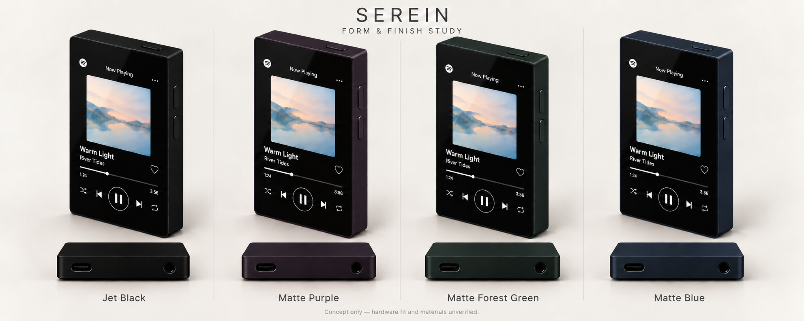

# Serein

Serein is a pocket music player that brings everyday listening and a portable DJ library into one dedicated object.

**Stage:** product definition and feasibility. No electronics have been selected or purchased, and no working device exists yet.

*Visual concept only. Dimensions, component fit, materials, battery life, and CDJ compatibility are not verified. The screen is illustrative; the first Spotify prototype is intended to use the official Android app.*

## Start here

- [Continuation](docs/continuation.md): compact current state and exactly one next action.
- [USB compatibility review](docs/usb-compatibility-review.md): decision rationale, cheaper splitter candidate and ready-to-send supplier questions.
- [Task tracker](docs/task-tracker.md): tasks, dependencies, checks, and owner acceptance.
- [Decision log](docs/decision-log.md): stable approval records and open proposals.
- [Working agreement](docs/working-agreement.md): owner-approved CTO/project-management process.
- [Cloud handoff](docs/cloud-handoff.md): full copy-paste instructions and assistant update.

- [Product brief](docs/product-brief.md): purpose, scope, and collaboration.
- [Requirements and decisions](docs/decisions.md): agreed direction, provisional targets, and open questions.
- [Feasibility work](docs/feasibility.md): Spotify, CDJ storage, battery, and physical fit.
- [Cloud setup](docs/cloud-setup.md): continue from this repository in Codex Cloud.
- [Sync workflow](docs/sync-workflow.md): publish completed tasks and pick up changes across local and cloud sessions.
- [Agent instructions](AGENTS.md): how future sessions should work with the project owner.

## Current task and next action

SER-005's cloud handoff is accepted. Gemini MDJ-500 is chosen for preliminary basic testing; actual access and Pioneer compatibility remain unverified. SER-007's [USB-storage-first assessment](docs/prototype-architecture.md) now recommends a ZERO 3W one-board bench experiment for owner review. [Release-linked source evidence](docs/zero3w-usb-evidence.md) supports the kernel/storage and developer-access path; downloaded-image behavior and physical USB/deck tests remain unverified. The [display/power comparison](docs/display-power-assessment.md) retains ZERO 3W for the USB experiment and identifies CM3 as a stronger custom-pocket integration lead; screen fit and endurance remain unverified. The [concrete bench plan](docs/usb-bench-plan.md) is delivered; board/image and 5 V power checks block purchasing/execution. A powered hub is a computer-only alternative because the Gemini manual prohibits hubs. The [compatibility follow-up](docs/usb-compatibility-review.md) finds AIC8800D80 source support and prefers a new $14.95 official PiKVM splitter candidate ($54.94 board/splitter subset before separate supply/accessories/delivery). Exact sold board/binary and splitter USB-C matching remain open. Next obtain the two prepared vendor confirmations before kit approval; no supplier contacted. Evidence and decision summaries must also be shown in chat under DEC-025. Generic Spotify proof is deferred to routine candidate checks; no electronics, purchases or integrated architecture are selected. See [DJ test targets](docs/dj-test-targets.md).

The assistant handles CTO and project-management work. The human is the project owner and retains consequential decisions and final acceptance.

Budget discussion is deferred until the technical and physical direction is clearer.

## Repository scope

This repository is the shared record for research, decisions, concepts, and future hardware/software development. It currently contains documentation and a concept image; there are no build dependencies or application tests yet.
