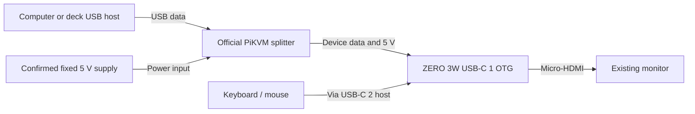
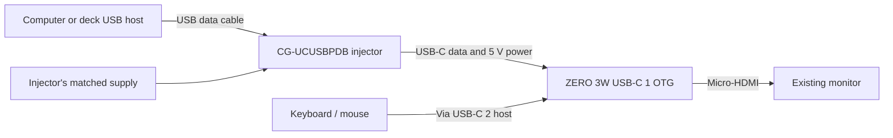

# SER-007 — ZERO 3W USB bench kit and test plan

Prepared: 2026-10-05 under DEC-023; compatibility follow-up under DEC-024. Concrete research deliverable for owner review. **Purchase and execution are blocked by the board/image match and exact 5 V power behavior described below.** No equipment was purchased, connected, formatted or flashed.

## Purpose and recommendation

Test one question: can the selected Android system reliably present a small owned-file disk as USB mass storage while Android runs, then return it to local use without concurrent writes?

Use a new **2 GB Radxa ZERO 3W without eMMC**, microSD boot, an existing HDMI monitor and keyboard/mouse if available. This remains a USB experiment; it does not select finished Serein hardware. No pocket screen, battery, case or additional storage processor is needed for this first experiment. See [release-linked Android evidence](zero3w-usb-evidence.md).

A computer can test the storage protocol first. A deck test additionally requires a direct connection and its own power/compatibility evidence. The Gemini choice remains accepted for preliminary playback, with actual access unknown; real Pioneer CDJ/XDJ validation is still required.

## Parts list

All purchasing candidates are new. Existing accessories may be reused after inspection. These are exact model leads or connector specifications; unresolved vendor confirmations prevent presenting this as a ready-to-order cart.

| Item | Concrete candidate / required specification | Role and cost status |
| --- | --- | --- |
| Android board | Radxa ZERO 3W, 2 GB, no eMMC, soldered header; SKU RS107-D2E0H1W15 | [Arace](https://arace.tech/products/radxa-zero-3w) displayed $39.99, in stock. Exact shipped revision/wireless variant and image compatibility need confirmation |
| Boot card | Kingston Canvas Select Plus Gen3 64 GB microSDXC, SDCS3/64GB, or an existing genuine disposable card | [Manufacturer model](https://www.kingston.com/en/memory/search?partid=SDCS3%2F64GB) checked. Price unquoted. 64 GB card capacity is not a claim of 64 GB available DJ storage |
| Card reader | Existing microSD reader with the appropriate laptop connector, or a new reader specified after ports are known | Needed to prepare/recover the disposable boot card; price unquoted |
| Display connection | Micro-HDMI Type-D male to HDMI Type-A male data/video cable, preferably short; existing HDMI monitor or TV | Uses the board's HDMI output. Cable price unquoted; HDMI port on a laptop is not assumed to be a display input |
| Input devices | Existing USB keyboard/mouse connected to board USB-C 2 host through the appropriate USB-C male to USB-A female adapter/hub | Keep input peripherals on the board's host port, separate from its USB-C 1 gadget port. Access and any accessory cost unknown |
| Preferred direct power/data candidate | Official **PiKVM USB Power/Data Splitter**, PiShop SKU 1106-2, plus a separately confirmed fixed 5 V / 3 A supply | [PiShop](https://www.pishop.us/product/pikvm-usb-power-data-splitter/) displayed $14.95, new/in stock; [manufacturer](https://pikvm.org/new/) documents separated power/data and prevention of backpower. Exact ZERO 3W USB-C/OTG behavior and supply pairing still need confirmation; supply price unquoted |
| Splitter cables | USB-A male to USB-C male host data cable; short USB-C male to USB-C male device data cable rated at least 3 A | Connector leads follow the PiKVM handbook for Raspberry Pi. Confirm the exact module/supply/board pairing and package contents; laptop USB-C-only cable depends on ports. No generic Y cable |
| Direct injector fallback | Coolgear **CG-UCUSBPDB** with matched supply, not CG-UCUSBPD | [Manufacturer](https://www.coolgear.com/product/usb-c-usb-b-power-delivery-adapter-wmounting-kit) shows $118.29/in stock. Non-PD current/isolation remain unconfirmed; supply descriptions conflict. Listed C-to-C cable; upstream A-to-USB-3-B data cable adds unquoted cost. Alternative, not an additional purchase |
| Baseline/test media | Existing disposable USB flash drive and a few owned WAV/MP3 files | Needed before deck tests; no Spotify cache or valuable music library used. Access unknown |

Preferred advertised board + splitter subset: **$54.94 USD**, excluding the separate 5 V supply, card, cables, reader, tax, delivery and display equipment. Earlier board + injector subtotal was $158.28; that injector listing includes a supply, so the $103.34 subset difference is not a complete-kit saving. These are listing arithmetic, not delivered quotes or an approved budget. Gemini's advertised $229.95 is separate; purchasing it is unnecessary for the first computer enumeration test. Location and laptop connectors have been requested from the owner; no location assumption or checkout has been made.

## Power/data connection

The board's USB-C 1 combines 5 V input and USB 2 OTG. Its USB-C 2 is the host port. [Current Radxa product brief](https://dl.radxa.com/zero3/docs/hw/3w/radxa_zero_3w_product_brief.pdf), revision 1.12 dated 2026-09-20, specifies a 5 V / 2 A supply and also documents GPIO power input. GPIO power input alone does not prove isolation from host VBUS; no dual-source wiring is approved here.

### Official PiKVM splitter — preferred candidate, conditional

The [compatibility review](usb-compatibility-review.md) records the rationale and ready-to-send vendor questions. Manufacturer documentation describes separate 5 V power and direct USB data with shared ground, preventing supply power returning to the host. Its supply guidance reaches 3 A. This is stronger documentation for the needed topology at much lower accessory cost.



This is a proposed topology for compatibility confirmation, not a validated wiring instruction. Establish the exact SKU's CC role/current advertisement, at least 2 A continuous at 5 V without PD negotiation, host VBUS separation, direct data path and compatibility with ZERO 3W attachment detection. Confirm a named supply/cable pairing. PiKVM's Raspberry Pi compatibility does not prove Radxa compatibility. Do not substitute another manufacturer's splitter or schematic.

### Direct injector route — fallback, conditional



This is a **proposed topology**, not a validated wiring instruction. The [matching injector manual](https://www.coolgear.com/wp-content/uploads/2017/08/CG-UCUSBPDB-Product-Manual.pdf) documents USB 2.0 host support and a 5 V / 3 A PD profile. The [matching technical sheet](https://www.coolgear.com/wp-content/uploads/CG-UCUSBPDB_Technical-Data-Sheet-06-241115.pdf) lists a supply in the package. Before approval, establish:

1. Does the downstream port supply **5 V with at least 2 A available to a non-PD, Rd-only sink** such as the exact board? A 5 V / 3 A PD profile alone does not establish this. Never request or force higher voltage on ZERO 3W.
2. Does upstream USB 2 D+/D− pass to the downstream device without an enumerating hub? Confirm expected device topology and behavior with upstream host VBUS absent/present.
3. Is externally supplied power prevented from feeding back into upstream host VBUS? The reviewed documents do not establish reverse-power isolation; the technical sheet lists electrical protections as N/A.
4. Which supply and cables are included in the exact order? Manufacturer now lists in stock at $118.29, but different supply ratings appear across the page; obtain the exact matched adapter specification. C-to-C cable is listed; upstream A-to-B cable is not. Local stock/delivery remain unknown. Supply connects only to the injector's prescribed input, never to the board's GPIO or USB-C directly.

These are supplier/documentation questions, not evidence of a product fault. No Coolgear inquiry was sent; the preferred board/PiKVM questions were sent separately under DEC-027. Do not substitute CG-UCUSBPD: its documented data direction is Type-C host to USB-A device and does not match this proposed connection.

### Powered hub route — computer-only alternative

[StarTech 311UE-USB-HUB datasheet](https://media.startech.com/cms/pdfs/311ue-usb-hub_datasheet.pdf) identifies a downstream USB-C **data** port rated up to 15 W, a supplied external adapter and a dual USB-A/USB-C host cable. It is a concrete alternative for the computer test if its unnegotiated 5 V/current behavior is confirmed. Use its downstream USB-C port for the board; price and exact plug region are unquoted. The hub's adapter output is for the hub, not a direct board supply. This is an alternative to the injector, not an instruction to buy both.

**Do not place a hub between the Gemini and board.** The Gemini-authored [MDJ-500 manual, page 14, hosted by a retailer](https://www.cavallimusica.com/media/productattach/m/d/mdj-500_user_manual.pdf) states that hubs are unsupported and describes E-1006 for too many devices. This older manual's dimensions differ from the current product page, so check the supplied manual/firmware of the actual player; honor the hub restriction unless matching manufacturer evidence changes it. Do not assume other decks support hubs either.

Direct laptop USB-C can avoid an extra power accessory only if the exact port supplies adequate 5 V current alongside data; an arbitrary USB-A port or an undocumented USB-C port is not assumed sufficient. No improvised power splitters, GPIO plus live host VBUS, forced-PD triggers or charge-only/data-blocking cables are proposed.

## Recoverable test sequence, after scoped owner approval

### 0 — Readiness and recovery

- Record actual board revision, wireless chip, SKU, host OS/ports, cables, power arrangement and equipment access. The [Radxa downloads page](https://docs.radxa.com/en/zero/zero3/download) lists an AIC8800 hardware schematic; current listings advertise Wi-Fi 6/BT 5.4. Follow-up pinned-source review establishes AIC8800 enablement and AIC8800D80 code; image/schematic age alone is not incompatibility evidence. Match the exact sold chip and verified binary; source support is not a live Wi-Fi/Bluetooth pass.
- Record exact image tag, filename, checksum, download/source provenance and recovery procedure. [Manufacturer Android installation](https://docs.radxa.com/en/zero/zero3/other-os/android/install-os) documents microSD boot and card-reader installation. Obtain separate approval covering overwrite of the specifically identified disposable card before flashing; leave the everyday laptop disks and any valued card untouched.
- Keep the original image and a recoverable card backup. No eMMC writes, Magisk/KernelSU installation or custom firmware authorized by approving this document alone.

### 1 — Boot and capability checks

Record Android build fingerprint/type, kernel version/effective config, gadget/UDC paths and actual developer permissions. The source-backed requirements are `CONFIG_USB_CONFIGFS_MASS_STORAGE=y`, configfs and a usable privileged control path. Developer ADB and the MSD app are distinct privilege routes. Do not assume a source-selected userdebug option means the downloaded binary provides root. If privilege or kernel support fails, preserve evidence and review a specific recoverable firmware-change plan before proceeding.

### 2 — Computer mass-storage test

Prepare a disposable **1 GiB whole-disk image with MBR/FAT32**, containing only a few owned test tracks and a hash manifest. Verify image creation on an approved workspace/card. Export this backing image, not the Android system disk or Spotify storage.

Pass criteria: host enumerates USB **mass storage**, can browse/play the files, file hashes match, and Android continues running without resets or USB drops. MTP file transfer is not a pass. Capture descriptors, logs, power arrangement and any faults. Start read-only; subsequently use a separate disposable writable clone to verify a host-created file survives eject and local remount.

### 3 — Exclusive storage ownership

Before export, close local file users, flush writes and release/unmount the backing filesystem. While the host owns it, Android must not mount or modify it. Host-eject, disable the gadget function, then restore local access. Use [kernel storage guidance](https://docs.kernel.org/usb/mass-storage.html).

Proposed bounded verification: five eject/reconnect cycles, matching hashes after each; one 30-minute playback/read session without resets; one writable-clone handoff with persistence and filesystem check. These are initial engineering checks, not production reliability certification. Abrupt power-loss behavior is a later disposable-image test.

### 4 — Gemini, then Pioneer

Proceed only after the computer checks and **direct deck power/data** arrangement pass. Establish playback on a known-good flash drive first. On the actual Gemini, record firmware, USB recognition, browsing, 30-minute playback, eject/reconnect and whether it writes to the volume. Use its USB-A playback port; USB-B MIDI and the owner's FLX4 do not substitute for this test.

Repeat on an accessible Pioneer CDJ/XDJ with a matching desktop rekordbox export and baseline: library/playlists, supported cues/grids/waveforms and deck writes. Success on a computer or Gemini cannot establish Pioneer compatibility. Keep the original export backed up and do not alter it simultaneously from Android.

## Evidence, status and single next action

Assistant checks: release-pinned AIC source and official PiKVM documentation reviewed under DEC-024; preferred splitter candidate and $54.94 board/splitter subset recorded. Two precise supplier-inquiry drafts are delivered in usb-compatibility-review.md. Matching injector manuals, recovery limits and computer/deck pass criteria remain documented. Actual image and circuitry were not inspected or tested; no live enumeration, deck playback or owner acceptance recorded. A complete delivered quote is unavailable.

**Single next action:** review Arace and PiShop replies for the two compatibility checks before final kit approval. Country/ports can narrow sourcing, but cannot resolve undocumented electrical behavior. The two inquiries are now prepared in [the compatibility review](usb-compatibility-review.md); the owner authorized them under DEC-027 and both saved sent copies are verified. Compatibility replies remain pending. Revisit the board/accessory if exact evidence fails; do not invent the answer.

Owner review: verify that the first test answers Android disk export, that the hub option applies only to a computer, and that neither the known subtotal nor permission to plan authorizes buying or flashing.

```text
Phase/status: Preparing the first desk experiment; awaiting supplier replies.
Completed: Both approved compatibility emails sent through Outlook; saved copies verified.
Decisions: Outlook supplier contact approved; hardware and purchases remain open.
Open: Supplier answers, full kit cost and actual hardware/deck tests.
Next task: Review both replies before final kit approval.
Needed from owner: Country/laptop ports for the later quote; no purchase yet.
```
